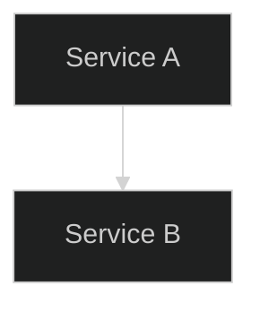

# 📐 Architecture Diagrams Index

All diagrams are in [Mermaid](https://mermaid.js.org/) format and can be rendered in:
- **GitHub** — natively in `.md` files using ` ```mermaid ` blocks
- **VS Code** — [Mermaid Preview extension](https://marketplace.visualstudio.com/items?itemName=bierner.markdown-mermaid)
- **Mermaid Live Editor** — https://mermaid.live
- **Notion / Confluence** — via Mermaid plugins

---

## Diagram Catalog

| Diagram | File | Type | Description |
|---------|------|------|-------------|
| 🌐 High-Level Architecture | [high-level-architecture.mmd](high-level-architecture.mmd) | Graph TB | Full platform overview across all clouds |
| ☁️ AWS Infrastructure | [aws-infrastructure.mmd](aws-infrastructure.mmd) | Graph TB | AWS VPC, EKS, RDS, MSK, services |
| ☁️ Azure Infrastructure | [azure-infrastructure.mmd](azure-infrastructure.mmd) | Graph TB | Azure VNet, AKS, CosmosDB, services |
| ☁️ GCP Infrastructure | [gcp-infrastructure.mmd](gcp-infrastructure.mmd) | Graph TB | GCP VPC, GKE, Spanner, Vertex AI |
| ☸️ Kubernetes Cluster | [kubernetes-cluster.mmd](kubernetes-cluster.mmd) | Graph TB | Full K8s topology with namespaces |
| 🔄 CI/CD Flow | [cicd-flow.mmd](cicd-flow.mmd) | Graph LR | Build → scan → deploy pipeline |
| 🔄 GitOps Flow | [gitops-flow.mmd](gitops-flow.mmd) | Graph TB | ArgoCD app-of-apps GitOps pattern |
| 📊 Observability Flow | [observability-flow.mmd](observability-flow.mmd) | Graph TB | Metrics, logs, traces pipeline |
| 🕸️ Service Mesh | [service-mesh.mmd](service-mesh.mmd) | Graph TB | Istio mTLS and traffic management |
| 🔐 Authentication Flow | [authentication-flow.mmd](authentication-flow.mmd) | Sequence | OAuth2/OIDC + JWT token lifecycle |
| 🛒 Request Flow | [request-flow-sequence.mmd](request-flow-sequence.mmd) | Sequence | Full purchase flow with tracing |
| 🚀 Deployment Flow | [deployment-flow.mmd](deployment-flow.mmd) | Graph TB | Canary deployment with rollback |
| 🔥 Disaster Recovery | [disaster-recovery.mmd](disaster-recovery.mmd) | Graph TB | Multi-cloud DR scenarios + RTO/RPO |

---

## How to Embed in Markdown

````markdown

````

---

## Diagram Conventions

### Color Coding
| Color | Meaning |
|-------|---------|
| 🟠 Orange (`#FF9900`) | AWS services |
| 🔵 Blue (`#0078D4`) | Azure services |
| 🔵 Blue (`#4285F4`) | GCP services |
| 🟢 Green (`#27ae60`) | Application services |
| 🟣 Purple (`#8e44ad`) | Infrastructure/platform |
| 🔴 Red (`#c0392b`) | Security components |
| 🩵 Teal (`#16a085`) | Monitoring/observability |
| 🟡 Yellow (`#E3B341`) | GitOps/deployment |

### Arrow Types
| Arrow | Meaning |
|-------|---------|
| `-->` | Synchronous request/data flow |
| `-.->` | Asynchronous / replication |
| `->>` | Sequence diagram request |
| `-->>` | Sequence diagram response |

---

## Updating Diagrams

1. Edit the `.mmd` file directly
2. Preview with `make diagram-preview FILE=docs/diagrams/xxx.mmd`
3. Commit changes — GitHub renders automatically
4. For complex changes, use [Mermaid Live Editor](https://mermaid.live) first
